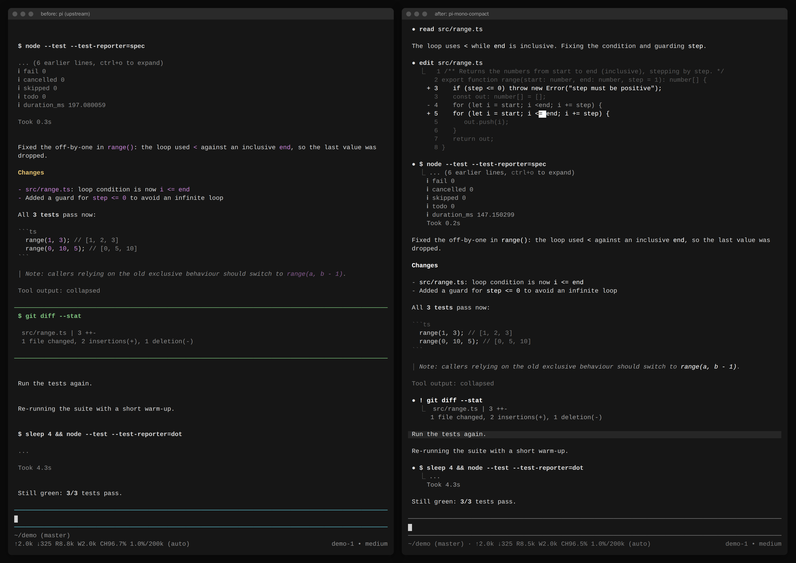
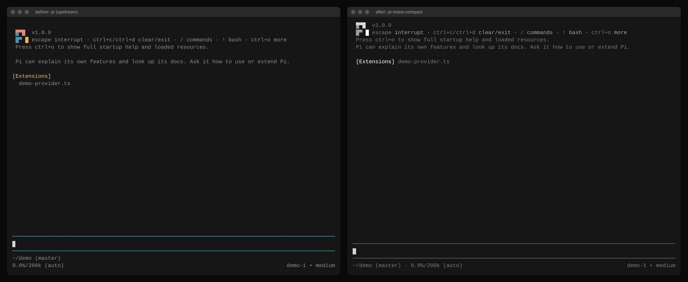
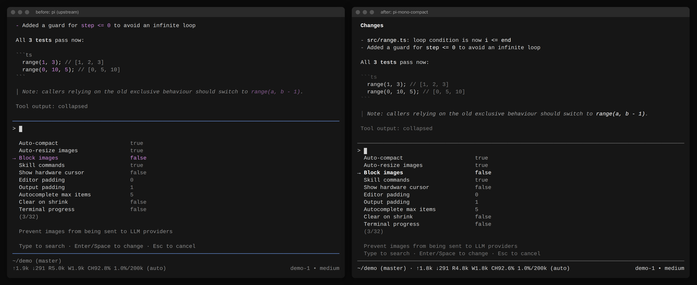
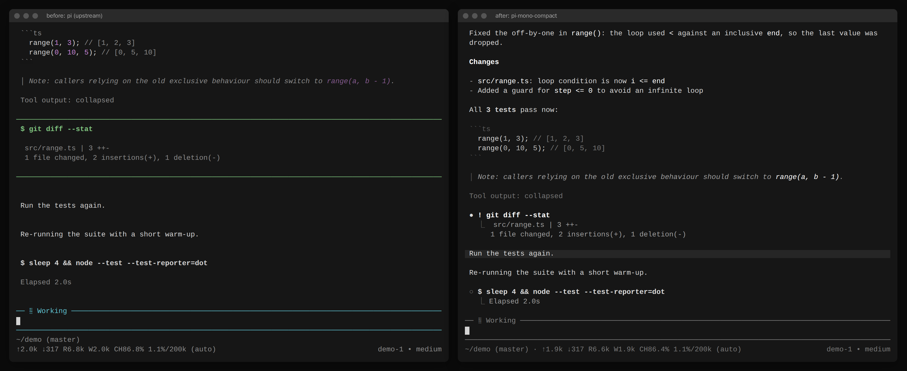
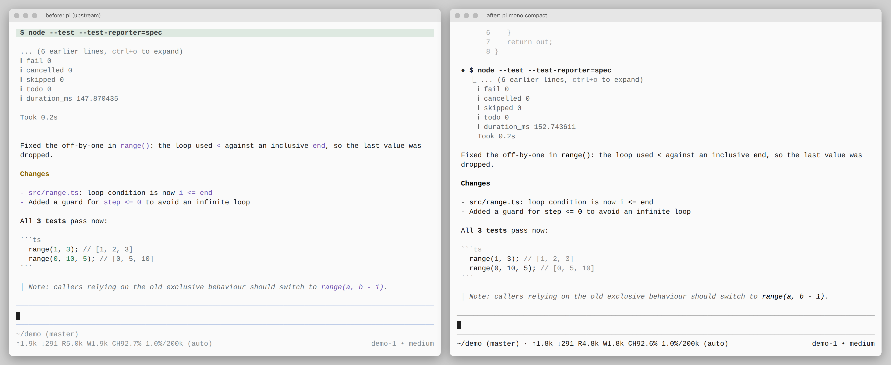

<p align="center">
  <a href="https://pi.dev">
    
  </a>
</p>
<p align="center">
  <a href="https://discord.com/invite/3cU7Bz4UPx"></a>
  <a href="https://www.npmjs.com/package/@earendil-works/pi-coding-agent"></a>
</p>

# pi-mono-compact

> **Unofficial fork** of [earendil-works/pi](https://github.com/earendil-works/pi), the Pi agent harness by Mario Zechner and contributors, forked at upstream commit [`0495646a8`](https://github.com/earendil-works/pi/commit/0495646a8322ff99ce40ac2f9e15f1f49f56bb11). It changes only how the interactive terminal UI looks: monochromatic and vertically compact, with density and restraint closer to Claude Code. Features, commands, keybindings, settings, packages, and the Pi name and logo are unchanged. Distributed under the same [MIT License](LICENSE) with the upstream copyright notice. This fork is not affiliated with or endorsed by the upstream project; report problems with it here, not upstream.



## What changed

- **Monochrome by default.** New `mono-dark` and `mono-light` themes, picked by the terminal's light/dark appearance (the default setting behaves like `"theme": "mono-light/mono-dark"`). Emphasis comes from lightness, bold, and glyph shape instead of hue. The colored `system`, `dark`, and `light` themes are still available in `/settings`.
- **Recognizable branding.** The pi logo keeps its shape and three-part structure, drawn in the theme's grays under monochrome themes and in its brand colors under colored themes.
- **Compact tool calls.** A tool call is one header line with a status glyph (`○` running, `●` done, `✗` failed), and its result hangs below behind a `⎿` gutter. The padded, colored panel and the blank lines inside it are gone. User `!` commands use the same layout instead of a bordered box.
- **Less vertical padding.** User prompts are a single shaded row instead of three. Startup hints, loaded resources (one line per section when collapsed), custom/compaction/branch messages, dialogs (no padding inside their borders), and the settings list lose decorative blank lines.
- **One-line footer** when the directory, token stats, and model fit the width; it falls back to the two upstream lines otherwise.
- **Keyboard focus without color.** Selected rows in lists and menus keep the `→` marker and are now also bold.

Measured on the same scripted session at 100 columns ([transcripts](compact/screenshots)): **101 lines before, 76 after (-25%)**. A user prompt takes 1 row instead of 3, a tool call header 1 instead of 3, and the footer 1 instead of 2.

| Startup | Settings |
|---|---|
|  |  |
| **Running tool** | **Light theme** |
|  |  |

More scenes: [slash commands](compact/screenshots/after-commands.png), [expanded tool output](compact/screenshots/after-expanded.png), [model selector](compact/screenshots/after-model.png), [session tree](compact/screenshots/after-tree.png).

## Use it

Requires Node.js 22.19 or later.

```bash
git clone https://github.com/youngsemicolon/pi-mono-compact.git
cd pi-mono-compact
npm install --ignore-scripts
npm run build

# Run from this checkout, in any project directory
/path/to/pi-mono-compact/pi-test.sh

# Or run the built CLI, e.g. under its own alias so an installed upstream `pi` stays untouched
alias pi-compact="node /path/to/pi-mono-compact/packages/coding-agent/dist/bundle/cli.js"
```

The fork reads the same configuration as upstream (`~/.pi/agent`), so logins, sessions, extensions, and skills carry over. An explicit `theme` in your `settings.json` still wins over the monochrome default:

- Monochrome, following the terminal: `/settings` → **Theme** → **automatic** with `mono-light` and `mono-dark`, or `"theme": "mono-light/mono-dark"`.
- Colors again: pick `system`, `dark`, or `light` in `/settings` → **Theme**, or run once with `--use-theme dark`.
- `--tui-mode regular` keeps output in the terminal's scrollback instead of fullscreen; the compact layout applies to both.

## Verification

- `npm run build` and `npm run check` (biome, type check, dependency and bundle checks) pass.
- `./test.sh` has no failures beyond those of unmodified upstream in the same environment (`find` tests need `fd`, and one bash truncation test fails under the isolated `LANG=C` test environment). Changed rendering is covered by updated tests and new ones in `packages/coding-agent/test/tool-block.test.ts`, `footer-width.test.ts`, `theme-controller.test.ts`, and `user-message.test.ts`.
- [`compact/`](compact/README.md) contains the scripted, provider-free demo session and the tmux capture scripts that produced every screenshot above from both upstream and this fork.

---

The upstream README follows.

> New issues and PRs from new contributors are auto-closed by default. Maintainers review auto-closed issues daily. See [CONTRIBUTING.md](CONTRIBUTING.md).

# Pi Agent Harness

This is the home of the Pi agent harness project including our self extensible coding agent.

* **[@earendil-works/pi-coding-agent](packages/coding-agent)**: Interactive coding agent CLI
* **[@earendil-works/pi-agent-core](packages/agent)**: Agent runtime with tool calling and state management
* **[@earendil-works/pi-ai](packages/ai)**: Unified multi-provider LLM API (OpenAI, Anthropic, Google, …)

To learn more about Pi:

* [Visit pi.dev](https://pi.dev), the project website with demos
* [Read the documentation](https://pi.dev/docs/latest), but you can also ask the agent to explain itself

## All Packages

| Package | Description |
|---------|-------------|
| **[@earendil-works/chord](packages/chord)** | Standalone application-composition runtime for services, replicated state, RPC, and plugins |
| **[@earendil-works/pi-telemetry](packages/telemetry)** | Vendor-neutral telemetry contracts, reference adapter, conformance tests, and typed schemas |
| **[@earendil-works/pi-ai](packages/ai)** | Unified multi-provider LLM API (OpenAI, Anthropic, Google, etc.) |
| **[@earendil-works/pi-durable](packages/durable)** | Durable conversation, task, and document runtime |
| **[@earendil-works/pi-agent-core](packages/agent)** | Agent runtime with tool calling and state management |
| **[@earendil-works/pi-coding-agent](packages/coding-agent)** | Interactive coding agent CLI |
| **[@earendil-works/pi-tui](packages/tui)** | Terminal UI library with differential rendering |

For Slack/chat automation and workflows see [earendil-works/pi-chat](https://github.com/earendil-works/pi-chat).

## Permissions & Containerization

Pi does not include a built-in permission system for restricting filesystem, process, network, or credential access. By default, it runs with the permissions of the user and process that launched it.

If you need stronger boundaries, containerize or sandbox Pi. See [packages/coding-agent/docs/containerization.md](packages/coding-agent/docs/containerization.md) for three patterns:

- **Gondolin extension**: keep `pi` and provider auth on the host while routing built-in tools and `!` commands into a local Linux micro-VM.
- **Plain Docker**: run the whole `pi` process in a local container for simple isolation.
- **OpenShell**: run the whole `pi` process in a policy-controlled sandbox.

## Contributing

See [CONTRIBUTING.md](CONTRIBUTING.md) for contribution guidelines and [AGENTS.md](AGENTS.md) for project-specific rules (for both humans and agents).  Longer term plans for Pi can also be found in [RFCs](https://rfc.earendil.com/keyword/pi/).

## Development

```bash
npm install --ignore-scripts  # Install all dependencies without running lifecycle scripts
npm run build         # Refresh model data, then build all packages
npm run build:offline # Rebuild using existing model data without network access
npm run check         # Lint, format, and type check
./test.sh            # Run tests (skips LLM-dependent tests without API keys)
./pi-test.sh         # Run pi from sources (can be run from any directory)
```

## Building standalone binaries from release source

GitHub releases include a versioned source archive covered by the release's `SHA256SUMS` file. Extract it and run the same build script used for the official standalone binaries:

```bash
VERSION="<release-version>"
tar -xzf "pi-${VERSION}-source.tar.gz"
cd "pi-${VERSION}"
./scripts/build-binaries.sh --offline-model-data --platform linux-x64 --out "$PWD/out"
```

The archive includes release model data and native prebuilds. `--offline-model-data` uses that model data without refreshing provider catalogs. The script installs dependencies and builds the executable with its runtime assets; pass `--skip-install` if dependencies are already provided.

## Supply-chain hardening

We treat npm dependency changes as reviewed code changes.

- Direct external dependencies are pinned to exact versions. Internal workspace packages remain version-ranged.
- `.npmrc` sets `save-exact=true` and `min-release-age=2` to avoid same-day dependency releases during npm resolution.
- `package-lock.json` is the dependency ground truth. Pre-commit blocks accidental lockfile commits unless `PI_ALLOW_LOCKFILE_CHANGE=1` is set.
- `npm run check` verifies pinned direct deps, native TypeScript import compatibility, and the generated coding-agent shrinkwrap.
- The published CLI package includes `packages/coding-agent/npm-shrinkwrap.json`, generated from the root lockfile, to pin transitive deps for npm users.
- Release smoke tests use `npm run release:local` to build, pack, and create isolated npm and Bun installs outside the repo before tagging a release.
- Local release installs, documented npm installs, and `pi update --self` use `--ignore-scripts` where supported.
- CI installs with `npm ci --ignore-scripts`, and a scheduled GitHub workflow runs `npm audit --omit=dev` plus `npm audit signatures --omit=dev`.
- Shrinkwrap generation has an explicit allowlist for dependency lifecycle scripts; new lifecycle-script deps fail checks until reviewed.

## Share your OSS coding agent sessions

If you use Pi or other coding agents for open source work, please share your sessions.

Public OSS session data helps improve coding agents with real-world tasks, tool use, failures, and fixes instead of toy benchmarks.

For the full explanation, see [this post on X](https://x.com/badlogicgames/status/2037811643774652911).

To publish sessions, use [`badlogic/pi-share-hf`](https://github.com/badlogic/pi-share-hf). Read its README.md for setup instructions. All you need is a Hugging Face account, the Hugging Face CLI, and `pi-share-hf`.

You can also watch [this video](https://x.com/badlogicgames/status/2041151967695634619), where I show how I publish my `pi-mono` sessions.

I regularly publish my own `pi-mono` work sessions here:

- [badlogicgames/pi-mono on Hugging Face](https://huggingface.co/datasets/badlogicgames/pi-mono)

## License

MIT

<p align="center">
  <a href="https://pi.dev">pi.dev</a> domain graciously donated by
  <br /><br />
  <a href="https://exe.dev"><br />exe.dev</a>
</p>
